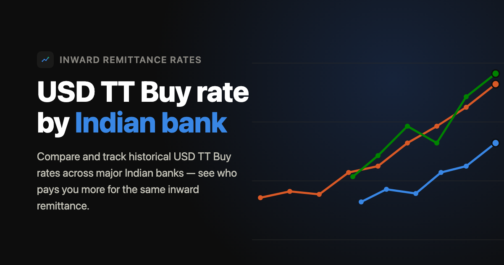

# TTBuy Dashboard

**Live site: [ttbuyrates.rakshithnettar.com](https://ttbuyrates.rakshithnettar.com)**



## Why this exists

When someone abroad sends you money, your bank converts it to rupees at its
own **TT Buy rate** — and that rate is different at every bank, often by a
meaningful amount. Nothing tells you upfront which bank pays you more for
the same transfer. Each bank only publishes its own rate, on its own page, in
its own format, with no history — so there's no single place to check "who's
paying the most today" or "how has this bank's rate moved over time."

This project scrapes that rate directly from ~22 major Indian banks' public
forex pages every day, keeps the history, and puts it all in one place so
anyone receiving foreign money can quickly see who pays the best rate — today
and over time.

## What the dashboard does

### Best value today

The first thing you see is a ranked table of every bank's current TT Buy rate for the selected currency.

- **Ranked by net receive, not raw rate** — banks are sorted by what you'd actually receive after each bank's own inward remittance fee (where known). A bank with a slightly lower rate but zero fee can rank above one with a higher rate but a large flat fee.
- **Amount calculator** — type how much you're receiving (e.g. $1,000) and every row updates instantly: you see the exact rupees credited at each bank and how much less you'd get vs. the best option.
- **Day-over-day change** (▲/▼) — shows how each bank's rate moved since yesterday. Only shown when there's an actual previous-day reading to compare against.
- **Fee info** — a small ⓘ next to a bank's name expands a tooltip showing that bank's published inward remittance fee schedule (flat fee, or tiered by amount). Banks whose fee schedule isn't publicly reachable are marked "≈" — that number is gross conversion only, not guaranteed net.
- **Insight badges** — below the table, the dashboard surfaces data-driven signals:
  - *Best rate most often* — which bank led the most days in the current period.
  - *Today's rate vs recent average* — whether today's best rate is above, near, or below the 7-day average, and which direction rates are trending.
  - *Most stable bank* — among the top-5 banks by average rate, which had the narrowest rate range (useful if you're timing a transfer and want predictability).
  - *Best day of the week* — if the data shows a statistically meaningful day-of-week pattern (requires ~2 weeks of history), it surfaces it.

### Currency optimizer

Covers all four currencies (USD, GBP, EUR, AED) at once on one screen.

- **Forward mode** — enter amounts for each currency (e.g. $1,000, £800) and see the single best bank for each one: TT Buy rate, fee deducted, and net rupees received.
- **Reverse mode** — flip to "Foreign → ₹" and enter a target INR amount (e.g. ₹1,50,000). The optimizer finds the bank that minimises how much foreign currency you need to send to clear that target after fees.

### Bank head-to-head

Pick any two banks and see how they stack up across all four currencies in one table.

- Each row is a currency; columns show each bank's TT Buy rate and the net rupees you'd receive at the default transfer amount.
- The **Advantage** column shows which bank wins that currency and by how much (e.g. "+₹1,525"), colored with that bank's brand color.
- A one-line **verdict** at the bottom summarises who wins overall: "IOB wins USD and GBP. PNB wins EUR and AED."
- A **swap button** between the two selectors reverses the comparison without re-selecting.

### Historical chart and table

- Plots every bank's TT Buy rate over time on a single chart, color-coded by bank.
- **Spike annotations** — dates where any bank's rate moved by more than ₹0.40 in a single day are marked with a filled circle on the chart. Hover a spike to see the exact move in the tooltip (e.g. "▲ ₹0.46").
- **Compare mode** — click "Compare" to enter a multi-select picker. Choose up to 4 banks to overlay; all other banks drop off the chart so the comparison stays readable.
- **Date range filters** — Last 7 days / 30 days / 90 days / 1 year / All time.
- **Toggle between chart and table** — the table view shows the same data as rows and columns, useful for exact figures.
- **CSV export** — downloads the currently visible data (selected currency, date range, banks) as a spreadsheet.
- **Search** — type a bank name or abbreviation (e.g. "SBI" finds "State Bank of India") to filter the bank list.

### Best bank per day calendar

A compact calendar heatmap where each day is colored by which bank had the highest TT Buy rate that day. Useful for spotting patterns — whether a particular bank consistently led on certain days, or whether there's a clear seasonal or weekly rhythm in who comes out on top.

### Shareable links and persistence

- **The URL always reflects your current view** — currency, date range, chart/table toggle, and calculator amount are all kept in the query string. Copy the URL from the address bar at any time to share the exact view you're looking at.
- **"Copy link" / "Share" button** — one click copies the URL to the clipboard (or triggers the native share sheet on mobile).
- **Remembers your last view** — the currency, date range, and toggle state are saved in `localStorage` so the next visit picks up where you left off. A shared link overrides saved state, so the recipient sees what you sent them, not their own saved settings.
- **Light / dark mode** — toggle at the top right. Preference is saved and applied before the first paint so there's no flash.

### Data freshness

The scraper runs automatically every day at 11 AM IST (with a 16:00 IST retry). The "Data last updated" line at the top of the page shows the most recent date present in the data.

## Layout

- `scraper/` — Python package. Each bank is a plugin in `scraper/banks/` (a
  `live_url`, optional `wayback_urls` for historical backfill, a `parse(content,
  source_url)` function, and a `kind`: `"html"` (default, decoded text),
  `"pdf"` (raw bytes, parsed with pdfplumber), `"browser"` (Playwright-
  rendered HTML, for pages whose rate table is populated by client-side JS),
  or `"pdf_discover"` (for a rate PDF whose filename rotates — `live_url` is a
  stable landing page, and `resolve_url(html)` extracts the current PDF link
  from it before fetching). Each `parse()` returns one row per currency found
  (`scraper/core.py`'s `TARGET_CURRENCIES`). `scraper/pipeline.py` handles
  fetching, Wayback Machine backfill, and CSV I/O; `scraper/main.py` is the
  CLI entrypoint. `scraper/fees/` mirrors this structure for inward
  remittance fee schedules (one plugin per bank, `scraper/fees_main.py` is
  the entrypoint) — a much less standardized set of documents than the daily
  rate pages, so each plugin returns a flexible `{rules, note}` shape rather
  than forcing every bank into the same fee-category axis.
- `data/` — per-bank CSV outputs, a combined `forex_TTBuy.csv`, the
  `rates.json` the site consumes (nested by currency, then bank), and
  `fees.json` (inward remittance fee info, nested by bank).
- `site/` — the dashboard (Vite + Vue 3 + TypeScript + SCSS).
- `.github/workflows/scrape.yml` — daily cron (11:00 IST, plus a 16:00 IST
  retry — harmless no-op for banks that already got today's rate, since
  `add_live_row` dedups per date) that re-scrapes live rates, regenerates
  `rates.json`, and commits the update (Netlify auto-deploys
  on push once connected to this repo).
- `.github/workflows/scrape-fees.yml` — monthly cron (1st of the month) that
  re-scrapes fee schedules. Separate from the daily rate cron since fee
  schedules barely ever change, unlike rates.
- `netlify.toml` — base `site/`, publishes `dist/`.

## Running the scraper

One-time setup:

```bash
cd ttbuy-dashboard
python3 -m venv .venv && .venv/bin/pip install -r scraper/requirements.txt
# Kotak/DCB/IDFC FIRST/DBS need a headless browser once:
.venv/bin/playwright install chromium
```

Day-to-day: fetch today's live rate for every bank (this is what the daily
cron runs) and refresh the site's data:

```bash
BANKS=axis,iob,bob,canara,icici,sbi,hdfc,kotak,idbi,bandhan,cityunion,hsbc,jkbank,kvb,citibank,ujjivan,dcb,idfcfirst,dbs,pnb,rbl,unionbank \
  MAX_SNAPSHOTS=0 .venv/bin/python3 -m scraper.main
.venv/bin/python3 -m scraper.export_json
cp data/rates.json site/public/data/rates.json
```

Env vars: `BANKS` (comma-separated slugs), `START_DATE`/`END_DATE` (Wayback
range, `YYYYMMDD`, default `20250530`–`20260530`), `MAX_SNAPSHOTS` (`0` =
skip Wayback backfill and only fetch today's live rate), `INCLUDE_LIVE`
(`0` to skip fetching today's rate, e.g. when only backfilling history).

Backfilling full Wayback history (all currencies, all snapshots in range) —
resumable and idempotent, so it's safe to re-run or Ctrl-C: it skips any
snapshot that already has all four currencies on file, and only fetches what's
missing (useful after adding a new currency, or if a run got interrupted or
hit a Wayback API outage partway through):

```bash
BANKS=axis,iob,bob,canara,icici,sbi,hdfc,kotak,idbi,bandhan,cityunion,hsbc,jkbank,kvb,citibank,ujjivan,dcb,idfcfirst,dbs,pnb,rbl,unionbank \
  INCLUDE_LIVE=0 .venv/bin/python3 -m scraper.main
.venv/bin/python3 -m scraper.export_json
cp data/rates.json site/public/data/rates.json
```

This walks ~14 months of history per bank against the Wayback CDX API, so it
takes a while and can hit transient timeouts — that's normal, just re-run the
same command again afterward to pick up whatever got skipped.

## Running the fee scraper

Fee schedules change far less often than daily rates (this is what the
monthly `scrape-fees.yml` cron runs), so there's no backfill/history to
manage here — just re-fetch and overwrite:

```bash
.venv/bin/python3 -m scraper.fees_main
cp data/fees.json site/public/data/fees.json
```

## Running the site

```bash
cd site
npm install
npm run dev
```

## Banks

22 banks scraped:

| Bank | Status |
|---|---|
| Axis Bank, IOB, Bank of Baroda, Canara Bank, ICICI Bank, IDBI Bank, Bandhan Bank, City Union Bank, HSBC | Scraped — plain HTML |
| SBI, HDFC Bank, Jammu & Kashmir Bank, Karur Vysya Bank, Citibank, Punjab National Bank, Union Bank of India | Scraped — stable daily PDF, parsed with pdfplumber |
| Ujjivan Small Finance Bank | Scraped — PDF filename rotates behind an opaque hash; a stable landing page (`/forex-rates`) always links to the current one, so this is a two-step fetch (`kind="pdf_discover"`) |
| RBL Bank | Scraped — `/fxadmin_getfx` endpoint returns the current PDF filename; a second fetch retrieves the PDF from the CDN. `kind="pdf_discover"` |
| Kotak Mahindra Bank, DCB Bank, IDFC FIRST Bank, DBS Bank India | Scraped — rates load via client-side JS, rendered with Playwright. No Wayback backfill (archived HTML wouldn't contain the rendered data), so history only starts accumulating from whenever the daily cron first ran. |
| Central Bank of India, Bank of Maharashtra | Rate is on a PDF whose URL/filename changes daily behind an opaque token or dated path, with no stable landing page found linking to it during research — needs a human to click through the site and find the current link |
| Karnataka Bank | PDF-only; the landing page also has a hidden decoy HTML table with fake data — do not scrape that table if this gets implemented |
| Union Bank of India | PDF is image-based (no extractable text) — would need OCR |
| Federal Bank, Indian Bank, Dhanlaxmi Bank, Tamilnad Mercantile Bank | PDF-only or no accessible rate page found |
| South Indian Bank, Bank of India, Equitas Small Finance Bank, ESAF Small Finance Bank | Blocked by Cloudflare/Akamai bot-challenge on plain HTTP GET |
| IndusInd Bank, RBL Bank | JS/AJAX-rendered; IndusInd's widget doesn't appear to expose a public rate without a booking flow, RBL calls an internal `/fxadmin_getfx` endpoint that's undocumented and might be worth trying directly |
| AU Small Finance Bank | JS-rendered widget returns "Authentication failed" without a browser session/token we don't have |
| CSB Bank | Rate page is an image (JPG), no extractable text — would need OCR |
| UCO Bank | Rate is an Excel (.xlsx) download, not HTML/PDF |
| Nainital Bank, Jana Small Finance Bank | No retail forex/NRI presence found |
| Utkarsh Small Finance Bank | Only stale, outward-remittance-only PDFs found — no current inward TT Buy rate |
| Standard Chartered India | PDF exists but TT and Bills rates are merged into one ambiguous column — can't isolate TT Buy reliably |
| Yes Bank, Punjab & Sind Bank | Unresolved — site access was inconclusive during research (mid-domain-migration / DNS failure respectively); worth a retry |
